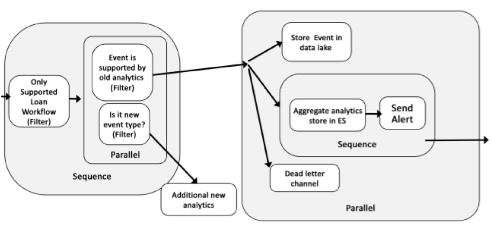

# Sample Knative composition of serverless Loan analytics application

Sample composition of serverless event-drive analytics application using Knative

## Overview

This sample demonstrates how to compose analytics for 
events coming from simple loan workflow. The workflow has four activities (such as Receive loan applicaion Evaluate, Gather evidence, and Decide).

The events are filtered, stored in data lake and Elastic Search, and analytics processes events to compute duration of activities. Output of analytics is stored in Elastic Search to visualize in Kibana dashboards. And the analytics may also create alert events.

## Reqirements

Knative Serving and Eventing version 1.13.
For instrucitons to install see for example [Red Hat Knative Tutorial](https://redhat-developer-demos.github.io/knative-tutorial/knative-tutorial/index.html)

## Deployment steps

See [README in config directory](config/README.md).

## TODO

Elastic Search and Kibana Open Distor version with link to docker-compose and/or k8s install

Use sample functions and events from [tutorial](https://github.com/aslom/serverless-nyc-bai-case-study)
